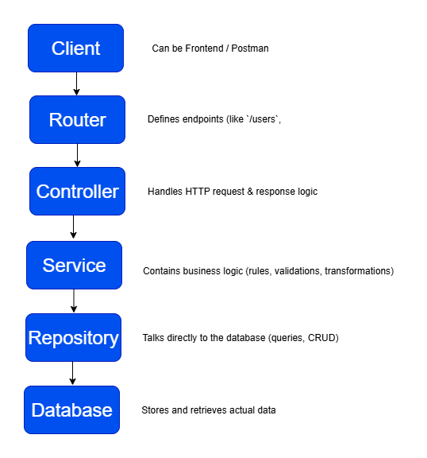

# Building CRUD APIs with Layered Modular Architecture

## Overview

This project uses a **Layered Modular Architecture** — a clean and scalable way to organize backend code by separating responsibilities.

Each layer in the architecture has a specific job: handling HTTP requests, applying business logic, or talking directly to the database.

This separation makes your API:

* **Easier to understand** (each piece does one thing)
* **Simpler to test** (you can test logic without touching the database)
* **Safer to modify** (changing one layer doesn’t break the rest)

### The Restaurant Model

Think of your API as a restaurant:

| Role                   | Description                       | In Code          |
| ---------------------- | --------------------------------- | ---------------- |
| **Customer**     | Sends requests (orders)           | Client / Postman |
| **Waiter**       | Takes the order and delivers it   | Controller       |
| **Chef**         | Prepares the meal (logic & rules) | Service          |
| **Supplier**     | Fetches ingredients               | Repository       |
| **Storage Room** | Where ingredients live            | Database         |

Each person (layer) has one job — and they work together to deliver a complete experience.

### Architecture Flow



## Why this structure?

- **Single Responsibility:** Each layer does one thing. Controllers handle HTTP requests, Services apply logic, and Repositories talk to the DB.
- **Testability**: You can test business logic (Services) without touching the database.
- **Maintainability**: If you change your database (e.g., move from SQL Server to PostgreSQL), only the repository changes.
- **Readability**: New developers can quickly see where each piece of logic lives.

## Folder mapping in this project

- `router/` — Defines the HTTP endpoints and connects them to controllers
- `controllers/` — Handles HTTP details like parsing requests and sending responses `services/` — Holds business logic and validation rules
- `repositories/` — Manages SQL queries and direct DB interactions
- `Types/` — Defines entity interfaces and shapes for strong typing

## CRUD Example — The `Todo` Flow

Let’s use the `Todo` feature to demonstrate how **Create, Read, Update, and Delete** work across the layers.

**Types**

```ts

// type todo
export interface Todo {
    todoid: number;
    todo_name: string;
    description: string;
    due_date: string;
    user_id: number;
}

// type creating new todo
export interface NewTodo {
    todo_name: string;
    description: string;
    due_date: string;
    user_id: number;
}

// type updating todo
export interface UpdateTodo {
    todo_name?: string;
    description?: string;
    due_date?: string;
    user_id?: number;
}
```

* **Todo** → the complete entity (as stored in the DB)
* **NewTodo** → used when creating new records
* **UpdateTodo** → used for partial updates (fields are optional)

### 1) Create (POST /todos)

**Flow**:

1. The **Client** sends a `NewTodo` payload to `POST /todos`.
2. The **Router** (`router/todo.routes.ts`) maps this path to the controller.
3. The **Controller** extracts the body and calls the service.
4. The **Service** applies business logic (if any).
5. The **Repository** executes an `INSERT` SQL query.
6. The **Controller** returns a `201 Created` response with the new Todo.

**Router:**

```ts
  app.post('/todos', todoController.createTodo);
```

**Controller**:

```ts
export const createTodo = async (req: Request, res: Response) => {
    const todo = req.body;
    try {
        const result = await todoServices.createTodo(todo);
        res.status(201).json(result);
    } catch (error: any) {
        res.status(500).json({ error: error.message });
    }
}
```

**Services**

```ts
export const createTodo = async (todo: NewTodo) => await todoRepositories.createTodo(todo);
```

**Repositories**

```ts
export const createTodo = async (todo: NewTodo) => {
    const pool = await getPool();
    await pool
        .request()
        .input('todo_name', todo.todo_name)
        .input('description', todo.description)
        .input('due_date', todo.due_date)
        .input('user_id', todo.user_id)
        .query('INSERT INTO Todos (todo_name, description, due_date, user_id) VALUES (@todo_name, @description, @due_date, @user_id)');
    return { message: 'Todo created successfully' };
}
```

## Error handling and validation

Each layer has its own responsibility for handling errors:

1. **Controllers** - Converts errors into proper HTTP responses (`400`, `404`, `500`)
2. **Services** - Checks business rules (e.g. "user must exist before creating a todo")
3. **Repositories** - Handles DB issues or failed queries

## Practical Tips

* Keep **controllers thin** — they should only parse requests and send responses.
* Keep **repositories simple** — they only run SQL queries or ORM operations.
* Keep **services smart** — this is where logic and rules live.
* Add **types** — using `NewTodo` and `UpdateTodo` ensures type safety in all layers.
* Write **unit tests** for services — that’s where your logic lives.

## When to Use This Structure

Use a layered architecture when:

* Your project will grow beyond a few endpoints.
* You want clean separation between logic and data access.
* You plan to write unit or integration tests.
* Multiple developers or trainees will collaborate on one backend.
* You may switch databases or frameworks later.
