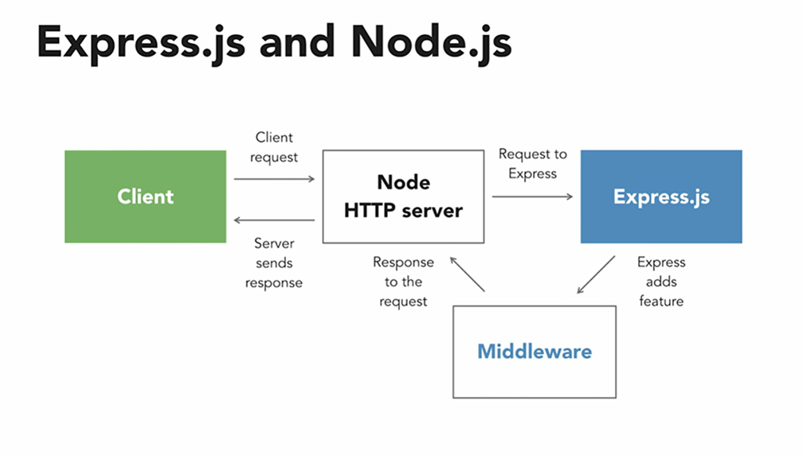

# WEB API

Welcome to this guide on building your first **Web API** using **Express** and  **TypeScript** !

In this session, we’ll explore how the web really works behind the scenes — how applications talk to each other, how data moves from the server to your screen, and how developers build that communication bridge called an  **API (Application Programming Interface)** .

Goals:

* Understand what a **Web API** is and how it works using real-world examples.
* Set up an **Express.js** server and connect it to a **Microsoft SQL Server** database.
* Write clean, modular **TypeScript** code following good architecture (controller, service, and repository pattern).
* Test your API using simple tools like **Postman** or  **Thunder Client** .

By the end of this guide, you won’t just know *what* an API is — you’ll know  *how to build one yourself* , step by step.

## What is an API?

**API** stands for **Application Programming Interface.**

Imagine you’re sitting in a restaurant.

* **You (the customer)** are the **client application** — maybe a web app, a mobile app, or even another backend service.
* **The kitchen** represents the **server** — this is where the actual logic, data, and processes live (like a database or business logic).
* **The waiter** is the **Web API (Application Programming Interface)** — the messenger between you (the client) and the kitchen (the server).

Here’s how it works step by step:

1. **You place an order (Request)**

- You tell the waiter what you want — for example, “I’d like a plate of Pilau😂.”
- Similarly, a client sends an **HTTP request** to the API, to get all todos

```http
GET /todos
```

**2. The waiter takes your order to the kitchen (Server)**

- The waiter doesn’t cook; he just **carries your request** to the right place.
- Likewise, the API **forwards your request** to the backend logic or database.

**3. The kitchen prepares the food (Processing)**

- The kitchen processes your order — maybe it fetches ingredients, cooks, and plates your meal.
- The server does the same — it runs your logic, fetches data, or updates records.

**4. The waiter delivers your meal (Response)**

- Once ready, the waiter brings your dish back to your table.
- Similarly, the API  **returns a response** , often in **JSON** format:

```json
[
  { "id": 1, "todo": "Finish project plan" },
  { "id": 2, "todo": "Update website" }
]

```

**5. The waiter also handles errors**

- If the kitchen runs out of ingredients (data not found) or burns the meal (server error), the waiter doesn’t panic — he politely tells you there’s a problem:
- With APIs, these can be:

```http
404 Not Found
500 Internal Server Error

```

An API (Application Programming Interface) is a way for different programs to talk to each other. For web development, a web API lets clients (like browsers or mobile apps) send requests to a server to get or change data.

Common API tasks:

- Get data (e.g., list of users)
- Create data (e.g., add a new user)
- Update data
- Delete data


APIs usually use HTTP and follow REST-style patterns.

## HTTP basics

Before we dive into building APIs, let’s understand the foundation they rely on —  **HTTP (HyperText Transfer Protocol)** .

Think of HTTP as the **language of the web** — it’s how a **client** (like your browser or Postman) talks to a **server** (like your Express app). Every time you visit a website or make an API call, a tiny conversation happens between the client and the server.

**HTTP Methods — What Action Are We Doing?**

- Methods: GET (read), POST (create), PUT/PATCH (update), DELETE (remove)
- Status codes: 200 (OK), 201 (Created), 400 (Bad Request), 404 (Not Found), 500 (Server Error)
- Headers: metadata attached to requests or responses (Content-Type, Authorization)

When building APIs, you'll create routes (URLs) that respond to these HTTP methods.

| Method                | Purpose              | Example                        |
| --------------------- | -------------------- | ------------------------------ |
| **GET**         | Retrieve data        | Get all users or a single todo |
| **POST**        | Create new data      | Add a new user or todo         |
| **PUT / PATCH** | Update existing data | Edit a user’s details         |
| **DELETE**      | Remove data          | Delete a todo                  |

Each method represents an **action** your API can perform on a resource.

### HTTP Status Codes — How Did It Go?

| Code                       | Meaning                             | When You Might See It          |
| -------------------------- | ----------------------------------- | ------------------------------ |
| **200 OK**           | Everything worked!                  | Successfully fetched data      |
| **201 Created**      | New resource created                | A new todo or user added       |
| **400 Bad Request**  | Something’s wrong with the request | Missing required data          |
| **404 Not Found**    | Can’t find what you asked for      | User or todo doesn’t exist    |
| **500 Server Error** | Problem on the server side          | Code bug or DB issue           |
| 204 No Content             | The request was successful          | No content to retun i.e delete |

### HTTP Headers — Extra Information

Headers carry additional details about each request or response — like attaching an envelope note.

Common ones include:

* `Content-Type`: tells the server what kind of data is being sent (e.g. JSON).
* `Authorization`: used to send authentication tokens (e.g. JWTs).

## What is Express?

- Express is a lightweight web framework for Node.js. It makes it easy to create routes, handle requests and responses, and add middleware (small functions that run during request processing).
- Fast, unopinionated, minimalist web framework for Node.js



REQUEST & RESPONSE Objects in Express

In Express, every time a client (like Postman, a browser, or a frontend app) sends a request to your server, Express provides **two main objects** inside your route handler. That is Request and Response.

```ts
app.get('/todos', (req, res) => {
   // req → represents the incoming request
   // res → represents the outgoing response
});

```

**Request (req)** -contains all the information **sent by the client** to the server.

Common properties:

| Property        | Description                                   | Example                                   |
| --------------- | --------------------------------------------- | ----------------------------------------- |
| `req.params`  | Route parameters                              | `/users/:id`→`req.params.id`         |
| `req.query`   | Query string parameters                       | `/users?role=admin`→`req.query.role` |
| `req.body`    | Data sent in the body (for POST/PUT requests) | `{ "name": "Brian" }`                   |
| `req.headers` | Metadata about the request                    | e.g.`req.headers.authorization`         |
| `req.method`  | HTTP method used                              | `GET`,`POST`,`PUT`,`DELETE`       |
| `req.url`     | The requested URL                             | `/todos/1`                              |

**Response (res)** -used by the server to **send a reply** back to the client.

Common Properties:

| Method             | Description           | Example                               |
| ------------------ | --------------------- | ------------------------------------- |
| `res.send()`     | Sends text or data    | `res.send("Hello World")`           |
| `res.json()`     | Sends JSON data       | `res.json({ message: "Success" })`  |
| `res.status()`   | Sets HTTP status code | `res.status(404).send("Not Found")` |
| `res.redirect()` | Redirects the client  | `res.redirect('/home')`             |
| `res.end()`      | Ends the response     | `res.end()`                         |

**Why Developers like Express?**

* **Lightweight:** You only add what you need.
* **Fast to set up:** Minimal configuration, quick to get started.
* **Middleware-friendly:** Add reusable logic (like authentication or logging) easily.
* **Extensible:** Works great with databases, templating engines, and ORMs.
* **Community-driven:** Tons of tutorials, examples, and packages.

## Why use TypeScript with Express?

TypeScript adds types to JavaScript. TypeScript helps by:

- Catching common mistakes before running the code
- Providing better editor (IDE) autocompletion and documentation hints
- Making the code easier to understand when types are explicit

Using Express with TypeScript gives you the simplicity of Express and the safety of typed code.

## Project setup (step-by-step)

These steps assume you are in your project folder and using pnpm. If you use npm or yarn substitute the commands accordingly.

The setup is similar to seeting up typcript project with tsx: [Teach2Give-Training-Resources/Setup-TypeScript-with-tsx](https://github.com/Teach2Give-Training-Resources/Setup-TypeScript-with-tsx)

1. Initialize the project (if not already):

```bash
pnpm init
```

2. Install development tools (TypeScript and types):

```bash
pnpm add -D typescript @types/node
```

3. Install Express and types for Express:

```bash
pnpm add express
pnpm add -D @types/express
```

4. Create a minimal `tsconfig.json` (if you don't have one).
   Create tsconfig.json file using the command below:

   ```bash
   pnpm tsc --init
   ```

```json
{
  "compilerOptions": {
    "target": "ES2022",
    "module": "NodeNext",
    "rootDir": "./src",
    // "moduleResolution": "node10",
    "moduleResolution": "nodenext",
    "outDir": "./dist",
    "esModuleInterop": true,
    "forceConsistentCasingInFileNames": true, 
    /* Type Checking */
    "strict": true,
    "skipLibCheck": true 
  },
  "include": [
    "src/**/*"   
  ],
  "exclude": [
    "node_modules",
    "**/*.spec.ts"
  ],
}

```

Have the following configurations for the typescript compiler.

## Minimal Express + TypeScript server

Create `src/index.ts` with this content :

```ts
import express from 'express'

const app = express();

app.use(express.json()); //parse JSON bodies

app.get('/', (req, res) => {
    res.send("Hello, express API is running...");
});

const port = 8081;
app.listen(port, () => {
    console.log(`Server is running on port: http://localhost:${port}`);
})


```

**Explanation**

- `express.json()` lets us read JSON bodies sent by clients
- `app.get('/api/users', ...)` defines a route
- `app.listen(...)` starts the server

## Useful scripts (add to `package.json` under "scripts")

Example scripts to add for a friendly dev experience:

```json
 "scripts": {
    "dev": "tsx watch src/index.ts",
    "build": "tsc",
    "start": "npm run build && node dist/index.js"
  }
```

- `pnpm run dev` — start a fast dev server that restarts on file changes
- `pnpm run build` — compile TypeScript into `dist/`
- `pnpm start` — run the compiled JavaScript

## .gitignore suggestions

Create a `.gitignore` file with the following content to avoid committing build artifacts and local environment files:

```
node_modules/
dist/
.env

```

## Run your Express API

1. Start dev server:

```bash
pnpm run dev
```

2. Open your browser and check the outcome at:

```
http://localhost:8081/
```

## Resources:

- Express official docs: https://expressjs.com/
- TypeScript handbook: https://www.typescriptlang.org/docs/handbook/intro.html
