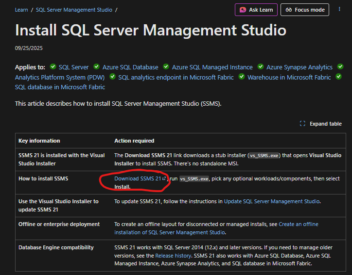

# 🗄️ Microsoft SQL Server Setup Guide

A complete guide to downloading, installing, and configuring Microsoft SQL Server and SQL Server Management Studio (SSMS).

---

## 📋 Table of Contents

1. [Downloading SQL Server](#-downloading-sql-server)
2. [Installing SQL Server](#-installing-sql-server)
3. [Installing SQL Server Management Studio (SSMS)](#-installing-sql-server-management-studio-ssms)
4. [Connecting to SQL Server](#-connecting-to-sql-server)
5. [Configuring Authentication](#-configuring-authentication)
6. [Enabling Remote Access](#-enabling-remote-access)

---

## 💾 Downloading SQL Server

### Step 1: Choose Your Edition

Visit the official Microsoft SQL Server download page:
- **Developer Edition (Recommended for Development)**: [Download SQL Server Developer](https://www.microsoft.com/en-us/sql-server/sql-server-downloads)

### Step 2: Download the Installer

1. Navigate to the download page
2. Click on **"Download now"** under your chosen edition
3. Save the installer to your preferred location (e.g., `Downloads` folder)
4. The file will be named something like `SQL2022-SSEI-Dev.exe` or `SQL2022-SSEI-Expr.exe`

---

## 🔧 Installing SQL Server

### Step 1: Run the Installer

1. **Double-click** the downloaded installer file
2. Choose an installation type:
   - **Basic**: Quick installation with default settings (Recommended for beginners)
   - **Custom**: Full control over installation options
   - **Download Media**: Download installation files for offline installation

### Step 2: Basic Installation (Recommended)

If you chose **Basic**:

1. Accept the license terms
2. Choose the installation location (default is usually fine)
3. Click **Install**
4. Wait for the installation to complete (5-15 minutes)
5. Note down the **Instance Name** and **Connection String** shown on the completion screen

### Step 3: Custom Installation (Advanced)

If you chose **Custom**:

1. **Installation Type**: Select "New SQL Server stand-alone installation"
2. **Product Key**: Enter your key or select the free edition
3. **License Terms**: Accept the license agreement
4. **Feature Selection**: Choose features to install
   - ✅ Database Engine Services (Required)
   - ✅ SQL Server Replication (Optional)
   - ✅ Full-Text and Semantic Extractions for Search (Optional)
   - ✅ Machine Learning Services (Optional)

5. **Instance Configuration**:
   - **Default instance**: Leave as `MSSQLSERVER` (recommended)
   - **Named instance**: Create a custom name (e.g., `SQLEXPRESS`, `DEV`)
   - Note: Named instances are accessed as `ServerName\InstanceName`

6. **Server Configuration**:
   - Leave default service accounts (NT Service accounts)
   - Set startup type to **Automatic** for SQL Server Database Engine

7. **Database Engine Configuration**:
   - **Authentication Mode**: 
     - Choose **Mixed Mode** (allows both Windows and SQL Server authentication)
     - Set a strong password for the `sa` account
   - **Add Current User**: Click to add your Windows account as an administrator
   - **Data Directories**: Accept defaults or customize locations

8. **Install**: Click Install and wait for completion

### Step 4: Verify Installation

After installation completes:

```powershell
# Check SQL Server services are running
Get-Service | Where-Object {$_.Name -like '*SQL*'}
```

Or check via **Services** app (search for "Services" in Windows Start menu) and look for:
- SQL Server (MSSQLSERVER) or SQL Server (YourInstanceName)
- SQL Server Agent (MSSQLSERVER)

---

## 🖥️ Installing SQL Server Management Studio (SSMS)

SSMS is a separate download and is essential for managing SQL Server.

### Step 1: Download SSMS

1. Visit: [Download SSMS](https://docs.microsoft.com/en-us/sql/ssms/download-sql-server-management-studio-ssms)
   
2. Click **"Download SQL Server Management Studio (SSMS)"**
3. Save the installer (file name: `SSMS-Setup-ENU.exe`)

### Step 2: Install SSMS

1. **Run the installer** as Administrator
2. Choose the installation location (default is recommended)
3. Click **Install**
4. Wait for installation to complete (10-20 minutes)
5. Click **Close** when finished
6. **Restart your computer** if prompted

### Step 3: Launch SSMS

1. Search for "SQL Server Management Studio" in the Windows Start menu
2. Click to launch the application
3. You're ready to connect to your SQL Server instance

---

## 🔌 Connecting to SQL Server

### Step 1: Open SSMS

Launch SQL Server Management Studio from the Start menu.

### Step 2: Connect to Server Dialog

The **Connect to Server** dialog should appear automatically. If not, click **Connect** > **Database Engine**.

### Step 3: Configure Connection Settings

**For Local Connections:**

```
Server type: Database Engine
Server name: 
  - For default instance: localhost or (local) or .
  - For named instance: localhost\InstanceName or .\InstanceName
Authentication: Windows Authentication (or SQL Server Authentication)
```

**Connection Examples:**
- Default instance: `localhost` or `.` or `(local)`
- Named instance: `localhost\SQLEXPRESS` or `.\Tiff`
- Remote server: `192.168.1.100` or `ServerName\InstanceName`

### Step 4: Choose Authentication Type

**Windows Authentication (Recommended for local development):**
- Uses your Windows login credentials
- No additional username/password needed
- Most secure option

**SQL Server Authentication:**
- Login: `sa` (or your SQL login name)
- Password: The password you set during installation
- Click **Remember password** (optional)

### Step 5: Connect

Click **Connect** button. If successful, you'll see the Object Explorer with your server name expanded.

### Troubleshooting Connection Issues

If connection fails:

```sql
-- Check SQL Server is running
-- Run in Command Prompt or PowerShell:
sqlcmd -S localhost -E

-- Or check services:
net start | findstr SQL
```

**Common issues:**
- SQL Server service not running
- Incorrect server name
- Firewall blocking connection
- TCP/IP protocol disabled

---

## 🔐 Configuring Authentication

### Understanding Authentication Modes

SQL Server supports two authentication modes:

1. **Windows Authentication Mode**: Uses Windows user accounts only (default)
2. **Mixed Mode**: Allows both Windows and SQL Server authentication

### Enabling Mixed Mode Authentication

#### Method 1: Using SSMS (Post-Installation)

1. **Connect to SQL Server** in SSMS
2. **Right-click** on the server name in Object Explorer
3. Select **Properties**
4. Go to the **Security** page
5. Under "Server authentication", select:
   - **SQL Server and Windows Authentication mode**
6. Click **OK**
7. **Restart SQL Server** for changes to take effect:
   - Right-click server name > **Restart**
   - Or use Services app to restart the service

#### Method 2: Using T-SQL

```sql
-- Enable Mixed Mode Authentication
USE [master]
GO
EXEC xp_instance_regwrite N'HKEY_LOCAL_MACHINE', 
     N'Software\Microsoft\MSSQLServer\MSSQLServer',
     N'LoginMode', REG_DWORD, 2
GO

-- Restart SQL Server after running this
```

### Creating SQL Server Logins

#### Enable and Configure SA Account

```sql
-- Enable the sa account
ALTER LOGIN sa ENABLE
GO

-- Set a strong password
ALTER LOGIN sa WITH PASSWORD = 'YourStrongPassword123!'
GO

-- Disable password policy (optional, not recommended for production)
ALTER LOGIN sa WITH CHECK_POLICY = OFF
GO
```

#### Create a New SQL Login

```sql
-- Create a new login
CREATE LOGIN dbuser WITH PASSWORD = 'SecurePassword123!@'
GO

-- Grant server-level permissions (optional)
ALTER SERVER ROLE sysadmin ADD MEMBER dbuser
GO

-- Or create for specific database
USE YourDatabaseName
GO
CREATE USER dbuser FOR LOGIN dbuser
GO
ALTER ROLE db_owner ADD MEMBER dbuser
GO
```

### Verify Authentication Mode

```sql
-- Check current authentication mode
SELECT CASE SERVERPROPERTY('IsIntegratedSecurityOnly') 
    WHEN 1 THEN 'Windows Authentication Only' 
    WHEN 0 THEN 'Mixed Mode (Windows and SQL Server Authentication)' 
END AS [Authentication Mode]
```

### View Existing Logins

```sql
-- List all SQL Server logins
SELECT 
    name AS LoginName,
    type_desc AS LoginType,
    is_disabled AS IsDisabled,
    create_date AS CreateDate,
    modify_date AS LastModified
FROM sys.server_principals
WHERE type IN ('S', 'U', 'G')
ORDER BY name
```

---

## 🌐 Enabling Remote Access

To allow remote connections to your SQL Server, you need to configure several settings.

### Step 1: Enable TCP/IP Protocol

#### Using SQL Server Configuration Manager

1. Open **SQL Server Configuration Manager**
   - Search for it in the Start menu
   - Or run: `SQLServerManager15.msc` (number varies by version)

2. Navigate to: **SQL Server Network Configuration** > **Protocols for [YourInstanceName]**

3. **Enable TCP/IP**:
   - Right-click **TCP/IP**
   - Select **Enable**

4. **Configure TCP/IP Properties**:
   - Right-click **TCP/IP** > **Properties**
   - Go to **IP Addresses** tab
   - Scroll to **IPAll** section
   - Set **TCP Port** to `1433` (default) or your custom port
   - Clear **TCP Dynamic Ports** (leave it empty)

5. **Restart SQL Server** for changes to take effect

#### Using PowerShell (Alternative)

```powershell
# Import SQL Server module
Import-Module SqlServer

# Enable TCP/IP protocol
$smo = 'Microsoft.SqlServer.Management.Smo.'
$wmi = new-object ($smo + 'Wmi.ManagedComputer')
$uri = "ManagedComputer[@Name='$env:COMPUTERNAME']/ServerInstance[@Name='MSSQLSERVER']/ServerProtocol[@Name='Tcp']"
$Tcp = $wmi.GetSmoObject($uri)
$Tcp.IsEnabled = $true
$Tcp.Alter()

# Restart SQL Server
Restart-Service -Name 'MSSQLSERVER' -Force
```

### Step 2: Configure Windows Firewall

#### Allow SQL Server Through Firewall (Port 1433)

**Using Windows Firewall GUI:**

1. Open **Windows Defender Firewall with Advanced Security**
2. Click **Inbound Rules** in the left pane
3. Click **New Rule** in the right pane
4. Select **Port** > Click **Next**
5. Select **TCP** and enter **1433** (or your custom port)
6. Select **Allow the connection**
7. Apply to all profiles (Domain, Private, Public)
8. Name it "SQL Server" and finish

**Using Command Prompt (Run as Administrator):**

```cmd
:: Allow SQL Server (port 1433)
netsh advfirewall firewall add rule name="SQL Server" dir=in action=allow protocol=TCP localport=1433

:: Allow SQL Server Browser (UDP port 1434) - for named instances
netsh advfirewall firewall add rule name="SQL Server Browser" dir=in action=allow protocol=UDP localport=1434

:: Allow specific program (alternative method)
netsh advfirewall firewall add rule name="SQL Server Database Engine" dir=in action=allow program="C:\Program Files\Microsoft SQL Server\MSSQL15.MSSQLSERVER\MSSQL\Binn\sqlservr.exe" enable=yes
```

**Using PowerShell:**

```powershell
# Allow SQL Server port
New-NetFirewallRule -DisplayName "SQL Server" -Direction Inbound -Protocol TCP -LocalPort 1433 -Action Allow

# Allow SQL Browser for named instances
New-NetFirewallRule -DisplayName "SQL Server Browser" -Direction Inbound -Protocol UDP -LocalPort 1434 -Action Allow
```

### Step 3: Enable SQL Server Browser (For Named Instances)

If using a named instance (e.g., `SQLEXPRESS`, `Tiff`):

1. Open **SQL Server Configuration Manager**
2. Go to **SQL Server Services**
3. Find **SQL Server Browser**
4. Right-click > **Properties**
5. Set **Start Mode** to **Automatic**
6. Right-click > **Start** to start the service

### Step 4: Enable Remote Connections in SQL Server

```sql
-- Enable remote connections
EXEC sp_configure 'remote access', 1
GO
RECONFIGURE
GO

-- Verify remote connections are enabled
EXEC sp_configure 'remote access'
GO
```

**Using SSMS:**

1. Right-click server name in Object Explorer
2. Select **Properties**
3. Go to **Connections** page
4. Check **Allow remote connections to this server**
5. Set **Remote query timeout** (0 = no timeout)
6. Click **OK**

### Step 5: Test Remote Connection

From a remote machine:

**Test with SSMS:**
```
Server name: ServerIPAddress\InstanceName
  Example: 192.168.1.100\SQLEXPRESS
  Or: ServerName.domain.com
Authentication: SQL Server Authentication
Login: sa (or your SQL login)
Password: YourPassword
```

**Test with Command Line:**

```cmd
:: Test connection using sqlcmd
sqlcmd -S 192.168.1.100,1433 -U sa -P YourPassword

:: For named instances
sqlcmd -S 192.168.1.100\SQLEXPRESS -U sa -P YourPassword
```

**Test with PowerShell:**

```powershell
# Test connection
$serverName = "192.168.1.100"
$database = "master"
$connectionString = "Server=$serverName;Database=$database;User Id=sa;Password=YourPassword;"

try {
    $connection = New-Object System.Data.SqlClient.SqlConnection
    $connection.ConnectionString = $connectionString
    $connection.Open()
    Write-Host "Connection successful!" -ForegroundColor Green
    $connection.Close()
} catch {
    Write-Host "Connection failed: $_" -ForegroundColor Red
}
```

### Step 6: Configure Network for Remote Access

**Find Your Server's IP Address:**

```cmd
ipconfig
```

Look for **IPv4 Address** under your active network adapter.

**For Static IP (Recommended for Servers):**

1. Open **Network and Sharing Center**
2. Click your network connection
3. Click **Properties**
4. Select **Internet Protocol Version 4 (TCP/IPv4)**
5. Click **Properties**
6. Select **Use the following IP address**
7. Enter your static IP configuration

### Troubleshooting Remote Access

```sql
-- Check if remote connections are enabled
SELECT name, value_in_use 
FROM sys.configurations 
WHERE name = 'remote access'

-- View current connections
SELECT 
    session_id,
    login_name,
    host_name,
    program_name,
    client_interface_name,
    login_time
FROM sys.dm_exec_sessions
WHERE is_user_process = 1
```

**Common Remote Connection Issues:**

1. **TCP/IP not enabled** - Enable in SQL Server Configuration Manager
2. **Firewall blocking** - Add firewall rules for port 1433 and SQL Browser
3. **SQL Server Browser not running** - Required for named instances
4. **Wrong connection string** - Use correct format: `Server\Instance,Port`
5. **Authentication failure** - Ensure Mixed Mode is enabled and credentials are correct
6. **Network connectivity** - Test with `ping` and `telnet ServerIP 1433`

**Test Port Connectivity:**

```powershell
# Test if port 1433 is open
Test-NetConnection -ComputerName 192.168.1.100 -Port 1433

# Or using telnet (if enabled)
telnet 192.168.1.100 1433
```

---

## ✅ Post-Installation Checklist

- [ ] SQL Server installed successfully
- [ ] SQL Server service is running
- [ ] SSMS installed and can connect locally
- [ ] Authentication mode configured (Windows or Mixed)
- [ ] SQL logins created with strong passwords
- [ ] TCP/IP protocol enabled
- [ ] Firewall rules configured
- [ ] Remote connections tested (if needed)
- [ ] Backup strategy planned
- [ ] Security best practices applied

---

## 🔒 Security Best Practices

1. **Use Strong Passwords**: Minimum 12 characters, mixed case, numbers, symbols
2. **Disable SA Account**: Use named accounts instead in production
3. **Limit Permissions**: Grant only necessary permissions to users
4. **Enable Encryption**: Use SSL/TLS for connections
5. **Regular Updates**: Keep SQL Server patched and updated
6. **Audit Logging**: Enable auditing for security events
7. **Backup Regularly**: Implement automated backup strategy
8. **Network Security**: Use VPN or private networks for remote access

---

## 📚 Additional Resources

- [SQL Server Documentation](https://docs.microsoft.com/en-us/sql/sql-server/)
- [SSMS Documentation](https://docs.microsoft.com/en-us/sql/ssms/sql-server-management-studio-ssms)
- [SQL Server Security Best Practices](https://docs.microsoft.com/en-us/sql/relational-databases/security/sql-server-security-best-practices)
- [Connection Strings Reference](https://www.connectionstrings.com/sql-server/)

---

## 🆘 Getting Help

If you encounter issues:

1. **Check SQL Server Error Logs**: 
   - Located at: `C:\Program Files\Microsoft SQL Server\MSSQL[version]\MSSQL\LOG\ERRORLOG`
   - Or view in SSMS: Management > SQL Server Logs

2. **Check Windows Event Viewer**:
   - Windows Logs > Application
   - Look for entries from source "MSSQLSERVER"

3. **Community Resources**:
   - [Stack Overflow - SQL Server](https://stackoverflow.com/questions/tagged/sql-server)
   - [Microsoft Q&A](https://docs.microsoft.com/en-us/answers/topics/sql-server.html)
   - [SQL Server Forum](https://social.msdn.microsoft.com/Forums/sqlserver/en-US/home)

---

**Installation Complete!** 🎉 You're now ready to start using Microsoft SQL Server.