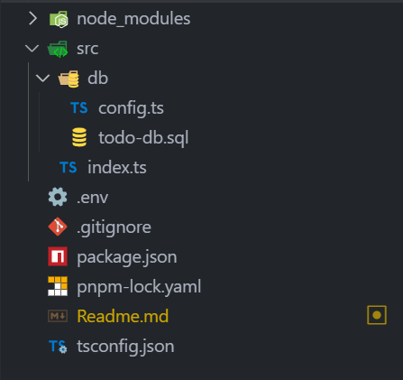
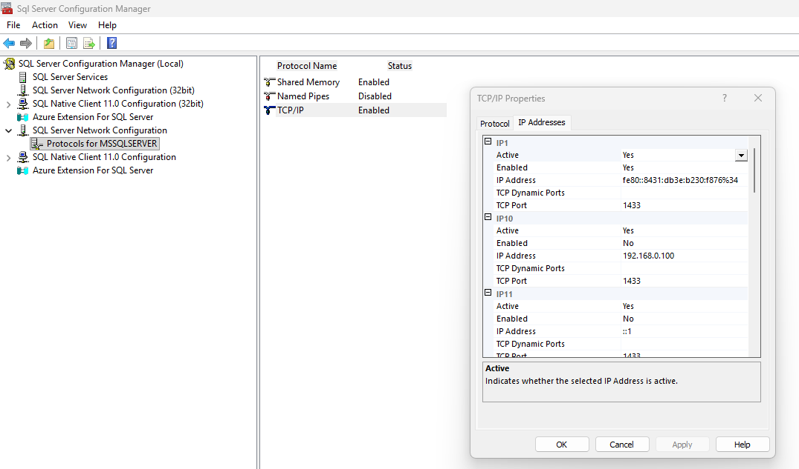
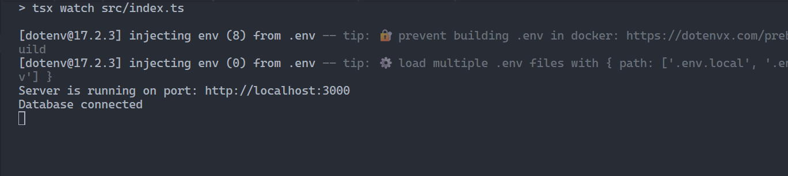

# Connecting Express to Microsoft SQL Server


This guide shows an Express API connected to Microsoft SQL Server using the `mssql` driver and environment configuration via `dotenv`.

The guide below uses the code in this repository. Attached is a folder structure:



- `src/db/todo-db.sql` — SQL schema + sample data
- `.env` — environment variables (project root)
- `src/db/config.ts` — database config and pool factory
- `src/index.ts` — Express app, routes and startup
- `package.json` — scripts for running in development

## 1) Create the database and tables

Create a database **todo-db** and execute the following SQL commands to create and insert data in VS-Code or SQL Server Management Studio.

```sql

--users table
CREATE TABLE Users (
    userid INT IDENTITY(1,1) PRIMARY KEY,
    first_name VARCHAR(40) NOT NULL,
    last_name VARCHAR(40) NOT NULL,
    email VARCHAR(100) UNIQUE NOT NULL,
    phone_number VARCHAR(15)
);

-- Sample data
INSERT INTO Users (first_name, last_name, email, phone_number) VALUES
('Alice', 'Mwangi', 'alice@gmail.com', '0711000001'),
('Brian', 'Kemboi', 'brian@gmail.com', '0711000002'),
('Carol', 'Koech', 'carol@gmail.com', '0711000003'),
('David', 'Mutiso', 'david@gmail.com', '0711000004'),
('Esther', 'Wambui', 'esther@gmail.com', '0711000005');


---todos table
CREATE TABLE Todos (
    todoid INT IDENTITY(1,1) PRIMARY KEY,
    todo_name VARCHAR(100) NOT NULL,
    description VARCHAR(MAX),
    created_at DATETIME DEFAULT GETDATE(),
    due_date DATETIME,
    user_id INT NOT NULL,
    FOREIGN KEY (user_id) REFERENCES Users(userid)
);

-- Sample data
INSERT INTO Todos (todo_name, description, created_at, due_date, user_id) VALUES
('Finish Project Plan', 'Prepare project plan for QA.', GETDATE(), '2025-10-09 00:00:00', 1),
('Update Website', 'Add new blog section and images.', GETDATE(), '2025-10-14 00:00:00', 2),
('Team Meeting', 'Weekly catch-up meeting.', GETDATE(), '2025-10-07 00:00:00', 1),
('Database Backup', 'Perform full SQL backup.', GETDATE(), '2025-10-12 00:00:00', 3),
('Create Logo Design', 'Work on new branding logo.', GETDATE(), '2025-10-22 00:00:00', 4),
('QA Testing', 'Run test cases for new feature.', GETDATE(), '2025-10-20 00:00:00', 5),
('Prepare Invoice', 'Generate invoices for clients.', GETDATE(), '2025-10-09 00:00:00', 3),
('Security Audit', 'Review user permissions and access.', GETDATE(), '2025-10-09 00:00:00', 2);


-- comments table
CREATE TABLE Comments (
    commentid INT IDENTITY(1,1) PRIMARY KEY,
    comment_name VARCHAR(MAX) NOT NULL,
    todo_id INT NOT NULL,
    user_id INT NOT NULL,
    FOREIGN KEY (todo_id) REFERENCES Todos(todoid),
    FOREIGN KEY (user_id) REFERENCES Users(userid)
);

-- Sample data

INSERT INTO Comments (comment_name, todo_id, user_id) VALUES
('Great progress so far!', 1, 2),
('Need to adjust the deadline.', 1, 3),
('Website images updated successfully.', 2, 1),
('Backup completed with no errors.', 4, 3),
('Logo draft looks amazing.', 5, 4),
('Please recheck test case #23.', 6, 5),
('Invoices reviewed and approved.', 7, 1),
('Access audit pending final review.', 8, 2),
('Add summary to meeting notes.', 3, 1),
('Team agrees with the new logo concept.', 5, 2);


```

Notes:

- The SQL file contains `CREATE TABLE` and `INSERT` statements to seed data used by the API.
- Make sure the database name in the script matches `SQL_DB` in your `.env`.

## 2) Install dependencies and create `.env`

Install node dependencies

```bash
pnpm install mssql
# or
npm install mssql
```


Create a `.env` file at the project root with the values your config expects. Example `.env`:

```properties
PORT=3000
SQL_SERVER={your server name}
SQL_USER=sa
SQL_PWD={your password}
SQL_DB=todo-db
SQL_ENCRYPT=true
```

Tips for `SQL_SERVER` values:

- Default instance on same machine: `localhost` or `127.0.0.1`
- Named instance: `HOSTNAME\INSTANCE` (example: `BRIAN-KEMBOI\SQLEXPRESS`)
- Host and port: `HOST,1433`

Security:

- Never commit `.env` to source control (add it to `.gitignore`).
- Use strong passwords and store production secrets in a secret manager.

## 3) Add `.env` credentials

If you prefer a connection string instead of individual variables, add this to `.env`:

```properties
SQL_CONNECTION_STRING=Server={your server name};Database=todo-db;User Id=sa;Password={password};Encrypt=true;TrustServerCertificate=true;
```

`mssql` accepts either a configuration object or a full connection string.

## 4) `src/db/config.ts` — create/configure the DB connection

This file is important because it exposes a small `getPool()` factory in `src/db/config.ts` which:

- loads environment variables (via `dotenv`)
- constructs either a connection string or an object accepted by `mssql`
- creates and caches a connection pool

```ts
import dotenv from 'dotenv';
import assert from 'assert'; //ensures that env variables are defined 
import sql from 'mssql';

dotenv.config(); // Loads the environment variables from .env file

const {
    SQL_SERVER,
    SQL_USER,
    SQL_PWD,
    SQL_DB,
    PORT
} = process.env; // Destructure environment variables


// Ensure all required environment variables are defined
assert(PORT, "PORT is required");
assert(SQL_SERVER, "SQL_SERVER is required");
assert(SQL_USER, "SQL_USER is required");
assert(SQL_PWD, "SQL_PWD is required");
assert(SQL_DB, "SQL_DB is required");


// Configuration object for the database connection
export const config = {
    port: PORT,
    sqlConfig: {
        user: SQL_USER,
        password: SQL_PWD,
        database: SQL_DB,
        server: SQL_SERVER,
        pool: { //pool is used to manage multiple connections to the database
            max: 10,
            min: 0,
            idleTimeoutMillis: 30000
        },
        options: {
            encrypt: true, // for azure 
            trustServerCertificate: true // Change to true for local dev / self-signed certs
        }
    }
};

//// Create a connection pool - a cache of database connections maintained so that the connections can be reused when future requests to the database are required.
export const getPool = async () => {
    try {
        const pool = await sql.connect(config.sqlConfig);
        return pool;
    } catch (error) {
        console.log("SQL Connection Error: ", error);
        throw error;
    }
};

```

Key points in the config file:

- `server` may be a hostname, `host,port`, or you can set `options.instanceName` for named instances.
- `options.encrypt` and `options.trustServerCertificate` control TLS behavior and are driven by `SQL_ENCRYPT`.
- The config file asserts required values when a connection string is not provided.

## 5) Test DB connection & run the server (`src/index.ts`)

- loads `dotenv` and starts an Express app
- imports `getPool()` from the config and uses it to run queries
- exposes endpoints:
  - `GET /` — health check
  - `GET /users` — `SELECT * FROM Users`
  - `GET /todos` — `SELECT * FROM Todos`

```ts
import express from 'express'
import sql from 'mssql';
import dotenv from 'dotenv';
import { getPool } from './db/config';

//create express app
const app = express();

//config dotenv - load env variables
dotenv.config();

//middleware
app.use(express.json()); //parse json request body

//Root route
app.get('/', (_, res) => {
    res.send("Hello, express API is running...");
});

//Fetch users with minimal error handling
app.get('/users', (req, res) => {
    getPool().then(pool => {
        return pool.request().query('SELECT * FROM Users');
    }).then(result => {
        res.json(result.recordset);
    }).catch(err => {
        console.log("SQL error", err);
        res.status(500).send("Server error");
    });
})

//Fetch todos with minimal error handling
app.get('/todos', (req, res) => {
    getPool().then(pool => {
        return pool.request().query('SELECT * FROM Todos');
    }).then(result => {
        res.json(result.recordset);
    }).catch(err => {
        console.log("SQL error", err);
        res.status(500).send("Server error");
    });
});

const port = process.env.PORT || 8081;
app.listen(port, () => {
    console.log(`Server is running on port: http://localhost:${port}`);
})

//test database connection
getPool()
    .then(() => console.log("Database connected"))
    .catch((err: any) => console.log("Database connection failed: ", err));

```

Start the app in development mode (package.json includes a dev script):

```bash
pnpm run dev
# or
npm run dev
```

On successful start you should see logs like `Server is running on port: http://localhost:3000` and `Database connected` (if `getPool()` connects)

Quick CURL checks:

```bash
curl http://localhost:3000/
curl http://localhost:3000/users
curl http://localhost:3000/todos
```

## Troubleshooting

- `ConnectionError: Failed to connect to HOST:1433`:

  - Confirm `SQL_SERVER` is correct.
  - If using a static port, specify `HOST,1433`.
  - Verify TCP/IP is enabled in SQL Server Configuration Manager and SQL Server service has been restarted.
  - Ensure Windows Firewall allows the SQL Server port.
- `AssertionError: PORT is required` or other missing env errors:

  - Ensure you run the app from the project root so `dotenv` can find `.env`.

## Guide to Enable TCP/IP.

1. Open SQL Server Configuration Manager
2. Go to SQL Server Network Configuration -> Protocols for MSSQLSERVER
3. Make sure that TCP/IP is Enabled
4. Right Click TCP/IP -> Properties
5. Go to the IP Address tab,, ensure that IPALL section matches this:

```java
TCP Port = 1433
```

6. Click OK

7. Restart the SQL Server Service

## Successfull Connection:

The image belows shows a successful database connection


