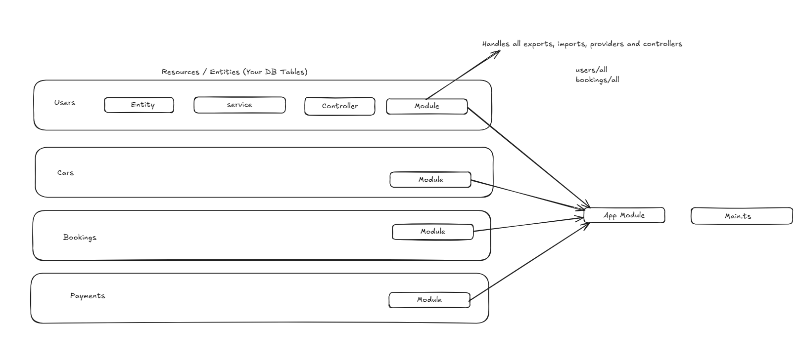
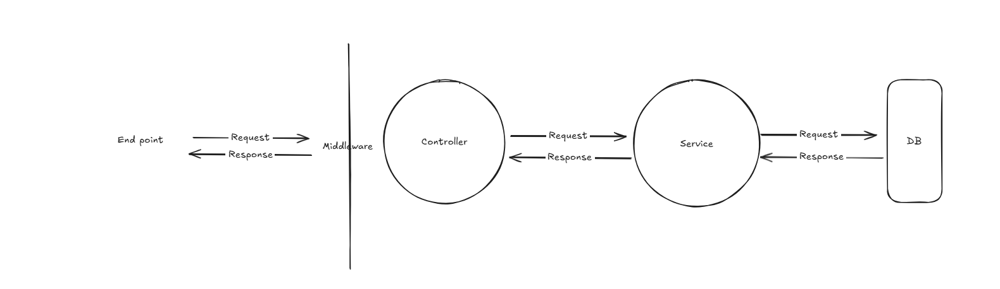

# NestJS Core Concepts for Car Rental Management System



## 1. Controllers

**Purpose**: Handle incoming HTTP requests and return responses to the client.

**Key Features**:

- Define routes using decorators (`@Get()`, `@Post()`, `@Put()`, `@Delete()`)
- Handle request data (params, query, body)
- Delegate business logic to services



**Example - Car Controller**:

```typescript
// src/car/car.controller.ts
import { Controller, Get, Post, Body, Param, Put, Delete } from '@nestjs/common';
import { CarService } from './car.service';
import { CreateCarDto } from './dto/create-car.dto';

@Controller('cars')
export class CarController {
  constructor(private readonly carService: CarService) {}

  @Post()
  create(@Body() createCarDto: CreateCarDto) {
    return this.carService.create(createCarDto);
  }

  @Get()
  findAll() {
    return this.carService.findAll();
  }

  @Get(':id')
  findOne(@Param('id') id: string) {
    return this.carService.findOne(id);
  }

  @Put(':id')
  update(@Param('id') id: string, @Body() updateCarDto: any) {
    return this.carService.update(id, updateCarDto);
  }

  @Delete(':id')
  remove(@Param('id') id: string) {
    return this.carService.remove(id);
  }
}
```

---

## 2. Providers (Services)
**Purpose**: Contain business logic and can be injected as dependencies.

**Key Features**:
- Marked with `@Injectable()` decorator
- Handle database operations, calculations, external API calls
- Can be injected into controllers or other providers
- Promote code reusability and separation of concerns

**Example - Car Service**:
```typescript
// src/car/car.service.ts
import { Injectable, NotFoundException } from '@nestjs/common';
import { CreateCarDto } from './dto/create-car.dto';

@Injectable()
export class CarService {
  private cars = [];

  create(createCarDto: CreateCarDto) {
    const car = {
      id: Date.now().toString(),
      ...createCarDto,
      availability: true,
    };
    this.cars.push(car);
    return car;
  }

  findAll() {
    return this.cars;
  }

  findOne(id: string) {
    const car = this.cars.find(car => car.id === id);
    if (!car) {
      throw new NotFoundException(`Car with ID ${id} not found`);
    }
    return car;
  }

  update(id: string, updateCarDto: any) {
    const carIndex = this.cars.findIndex(car => car.id === id);
    if (carIndex === -1) {
      throw new NotFoundException(`Car with ID ${id} not found`);
    }
    this.cars[carIndex] = { ...this.cars[carIndex], ...updateCarDto };
    return this.cars[carIndex];
  }

  remove(id: string) {
    const carIndex = this.cars.findIndex(car => car.id === id);
    if (carIndex === -1) {
      throw new NotFoundException(`Car with ID ${id} not found`);
    }
    this.cars.splice(carIndex, 1);
    return { deleted: true };
  }
}
```

---

## 3. Modules
**Purpose**: Organize application structure by grouping related components.

**Key Features**:
- Marked with `@Module()` decorator
- Define controllers, providers, imports, and exports
- Create a modular, maintainable architecture
- Enable feature encapsulation

**Example - Car Module**:
```typescript
// src/car/car.module.ts
import { Module } from '@nestjs/common';
import { CarController } from './car.controller';
import { CarService } from './car.service';

@Module({
  controllers: [CarController],
  providers: [CarService],
  exports: [CarService], // Export if other modules need it
})
export class CarModule {}
```

**App Module (Root)**:
```typescript
// src/app.module.ts
import { Module } from '@nestjs/common';
import { CarModule } from './car/car.module';
import { CustomerModule } from './customer/customer.module';
import { RentalModule } from './rental/rental.module';
import { PaymentModule } from './payment/payment.module';

@Module({
  imports: [
    CarModule,
    CustomerModule,
    RentalModule,
    PaymentModule,
  ],
})
export class AppModule {}
```

---

## 4. Dependency Injection (DI)
**Purpose**: Manage dependencies automatically, promoting loose coupling.

**How it Works**:
1. Mark classes with `@Injectable()`
2. Register providers in module
3. Inject via constructor

**Example**:
```typescript
// Rental service depends on Car service
@Injectable()
export class RentalService {
  constructor(
    private readonly carService: CarService,
    private readonly customerService: CustomerService,
  ) {}

  async createRental(createRentalDto: CreateRentalDto) {
    // Use injected services
    const car = await this.carService.findOne(createRentalDto.carId);
    const customer = await this.customerService.findOne(createRentalDto.customerId);
    
    // Business logic here
    return { rental: 'created', car, customer };
  }
}
```

**Module Configuration**:
```typescript
@Module({
  imports: [CarModule, CustomerModule], // Import modules with services you need
  controllers: [RentalController],
  providers: [RentalService],
})
export class RentalModule {}
```

---

## 5. Middleware
**Purpose**: Execute code before route handlers, can modify request/response.

**Use Cases**:
- Logging
- Authentication
- CORS handling
- Request validation

**Example - Logger Middleware**:
```typescript
// src/common/middleware/logger.middleware.ts
import { Injectable, NestMiddleware } from '@nestjs/common';
import { Request, Response, NextFunction } from 'express';

@Injectable()
export class LoggerMiddleware implements NestMiddleware {
  use(req: Request, res: Response, next: NextFunction) {
    console.log(`[${new Date().toISOString()}] ${req.method} ${req.url}`);
    next();
  }
}
```

**Apply Middleware**:
```typescript
// src/app.module.ts
import { Module, NestModule, MiddlewareConsumer } from '@nestjs/common';
import { LoggerMiddleware } from './common/middleware/logger.middleware';

@Module({
  // ... imports
})
export class AppModule implements NestModule {
  configure(consumer: MiddlewareConsumer) {
    consumer
      .apply(LoggerMiddleware)
      .forRoutes('*'); // Apply to all routes
  }
}
```

---

## 6. DTOs (Data Transfer Objects)
**Purpose**: Define the shape of data for requests and responses.

**Example**:
```typescript
// src/car/dto/create-car.dto.ts
export class CreateCarDto {
  carModel: string;
  manufacturer: string;
  year: number;
  color: string;
  rentalRate: number;
}

// src/rental/dto/create-rental.dto.ts
export class CreateRentalDto {
  carId: string;
  customerId: string;
  rentalStartDate: Date;
  rentalEndDate: Date;
}
```

---

## Complete Project Structure for Car Rental System

```
car-rental-system/
├── src/
│   ├── car/
│   │   ├── car.controller.ts
│   │   ├── car.service.ts
│   │   ├── car.module.ts
│   │   └── dto/
│   │       ├── create-car.dto.ts
│   │       └── update-car.dto.ts
│   │
│   ├── customer/
│   │   ├── customer.controller.ts
│   │   ├── customer.service.ts
│   │   ├── customer.module.ts
│   │   └── dto/
│   │
│   ├── rental/
│   │   ├── rental.controller.ts
│   │   ├── rental.service.ts
│   │   ├── rental.module.ts
│   │   └── dto/
│   │
│   ├── payment/
│   │   ├── payment.controller.ts
│   │   ├── payment.service.ts
│   │   ├── payment.module.ts
│   │   └── dto/
│   │
│   ├── insurance/
│   │   ├── insurance.controller.ts
│   │   ├── insurance.service.ts
│   │   ├── insurance.module.ts
│   │   └── dto/
│   │
│   ├── location/
│   │   ├── location.controller.ts
│   │   ├── location.service.ts
│   │   ├── location.module.ts
│   │   └── dto/
│   │
│   ├── reservation/
│   │   ├── reservation.controller.ts
│   │   ├── reservation.service.ts
│   │   ├── reservation.module.ts
│   │   └── dto/
│   │
│   ├── maintenance/
│   │   ├── maintenance.controller.ts
│   │   ├── maintenance.service.ts
│   │   ├── maintenance.module.ts
│   │   └── dto/
│   │
│   ├── common/
│   │   └── middleware/
│   │       └── logger.middleware.ts
│   │
│   ├── app.module.ts
│   └── main.ts
│
└── package.json
```

---

## Generating Resources with NestJS CLI

```bash
# Generate all resources for your system
nest generate resource car --no-spec
nest generate resource customer --no-spec
nest generate resource rental --no-spec
nest generate resource payment --no-spec
nest generate resource insurance --no-spec
nest generate resource location --no-spec
nest generate resource reservation --no-spec
nest generate resource maintenance --no-spec
```

This command automatically creates:
- Controller
- Service
- Module
- DTO files
- Updates app.module.ts

---

## Request Flow Summary

1. **HTTP Request** → Hits endpoint (e.g., `POST /cars`)
2. **Middleware** → Executes pre-processing (logging, auth)
3. **Controller** → Receives request, extracts data
4. **Service** → Performs business logic, database operations
5. **Response** → Returns to client via controller

---

## Key Benefits of NestJS Architecture

- **Modularity**: Each feature is self-contained
- **Testability**: Easy to mock services and test in isolation
- **Scalability**: Add features without affecting existing code
- **Maintainability**: Clear separation of concerns
- **Type Safety**: Full TypeScript support
- **Dependency Injection**: Automatic dependency management